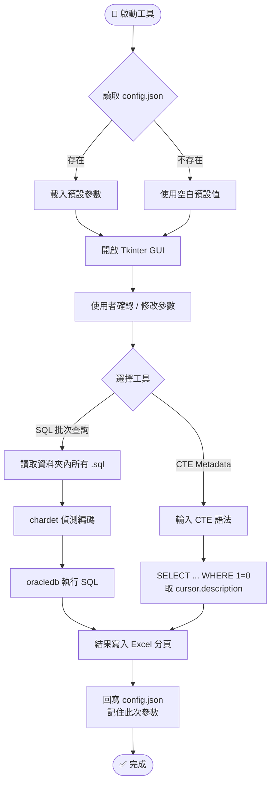

# 🛢️ oracle-cte-toolkit

> Oracle CTE 查詢與 Metadata 匯出工具組  
> 專為 **僅具查詢權限** 的 Oracle 使用者設計，透過 Tkinter GUI 快速批次執行 SQL 並匯出 CTE 欄位結構。

---

## 📁 專案結構

```
oracle-cte-toolkit/
├── .gitignore                  # Git 忽略清單（含 config.json）
├── build_exe.bat               # Windows 免安裝 exe 打包批次檔
├── config.example.json         # 設定檔範本（請複製為 config.json 後修改）
├── config_loader.py            # config.json 路徑、讀寫與 DSN 處理
├── excel_exporter.py           # Excel 查詢結果與 metadata 匯出
├── export_cte_metadata.py      # CTE 欄位 Metadata 匯出工具
├── oracle_client.py            # Oracle 連線與 metadata SQL 包裝
├── oracle_query_tool.py        # Oracle SQL 批次查詢工具
├── sql_reader.py               # SQL 檔案掃描、編碼偵測與讀取
└── tests/                      # 離線單元測試
```

> 💡 **注意**：`config.json` 已被 `.gitignore` 排除，首次使用請依 [設定步驟](#-設定步驟) 建立。

---

## 🧩 工具介紹

### 1️⃣ `oracle_query_tool.py` — SQL 批次查詢工具
- 📂 讀取指定資料夾內 **所有 `.sql` 檔案**
- 🔤 自動偵測編碼（支援 **UTF-8 / BIG5 / CP950** 等主流繁中編碼，透過 `chardet`）
- 📊 每個 SQL 結果對應 Excel 一個工作表，統一輸出到單一 `.xlsx`
- 🖥️ Tkinter GUI 操作，可即時輸入 / 選擇：
  - SQL 資料夾路徑
  - 輸出 Excel 路徑
  - 資料庫帳號 / 密碼 / DSN
- 💾 **記住上次輸入參數**（自動回寫 `config.json`）

### 2️⃣ `export_cte_metadata.py` — CTE Metadata 匯出工具
- 使用 `SELECT * FROM (你的 CTE) WHERE 1=0` 技巧，**不取回實際資料**，只讀取 `cursor.description`
- 📋 匯出欄位：`欄位名稱`、`資料型態`、`內部長度`、`精度`、`Scale`、`是否可 Null`
- 🔒 適用於 **無 `CREATE`、`DECLARE`、DDL 權限** 的環境
- 🖥️ 提供 Tkinter GUI，操作直覺

---

## ⚙️ 環境需求

| 項目 | 需求 |
|---|---|
| Python | **3.9 以上** |
| 作業系統 | Windows 10 / 11（其他 OS 需調整 `config.json` 路徑格式） |
| Oracle Client | `oracledb` 預設 Thin Mode，**免安裝 Instant Client** |

---

## 📦 安裝步驟

若只要使用已打包好的免安裝版本，可跳到 [免安裝執行檔](#-免安裝執行檔)。

```bash
# 1. Clone 專案
git clone https://github.com/<your-account>/oracle-cte-toolkit.git
cd oracle-cte-toolkit

# 2. 建立虛擬環境（建議）
python -m venv venv
venv\Scripts\activate            # Windows
# source venv/bin/activate       # macOS / Linux

# 3. 安裝套件
pip install -r requirements.txt
```

---

## 🧳 免安裝執行檔

本專案提供 Windows 打包批次檔，可將兩個 GUI 工具編譯成免安裝 `.exe`。打包會建立隔離的建置環境在 `build\package-venv`，並輸出到 `dist\oracle-cte-toolkit`。

### 建立執行檔

```bat
build_exe.bat
```

成功後會產生：

```text
dist\oracle-cte-toolkit\OracleQueryTool.exe
dist\oracle-cte-toolkit\CteMetadataExporter.exe
dist\oracle-cte-toolkit\config.example.json
```

### 發布與使用

將整個 `dist\oracle-cte-toolkit` 資料夾複製到目標 Windows 電腦即可使用。首次使用時：

```bat
copy config.example.json config.json
```

再編輯 `config.json` 的 Oracle 帳號、密碼、DSN、SQL 資料夾與輸出 Excel 路徑。兩個 exe 會從自身所在資料夾讀寫 `config.json`。

> `build/`、`dist/` 與 PyInstaller `.spec` 檔已被 `.gitignore` 排除，不應提交到版本庫。

---

## 🔧 設定步驟

### Step 1️⃣：複製設定檔範本
```bash
copy config.example.json config.json      # Windows
# cp config.example.json config.json      # macOS / Linux
```

### Step 2️⃣：編輯 `config.json`
```json
{
    "database": {
        "username": "your_oracle_username",
        "password": "your_oracle_password",
        "dsn": "hostname:1521/service_name"
    },
    "sql_folder_path": "d:\\your_path\\SQL_OUTPUT",
    "output_excel_path": "d:\\your_path\\output.xlsx"
}
```

| 欄位 | 說明 |
|---|---|
| `database.username` | Oracle 使用者帳號 |
| `database.password` | Oracle 密碼 |
| `database.dsn` | 連線字串 `host:port/service_name` |
| `sql_folder_path` | 存放 `.sql` 檔案的資料夾 |
| `output_excel_path` | 輸出 Excel 的完整檔名路徑 |

> ⚠️ `config.json` **含敏感資訊**，已被 `.gitignore` 排除，切勿手動加入 Git。

---

## 🚀 使用方式

### ▶ 使用 Python 執行 SQL 批次查詢工具
```bash
python oracle_query_tool.py
```

### ▶ 使用 Python 執行 CTE Metadata 匯出工具
```bash
python export_cte_metadata.py
```

### ▶ 使用免安裝 exe
```bat
dist\oracle-cte-toolkit\OracleQueryTool.exe
dist\oracle-cte-toolkit\CteMetadataExporter.exe
```

---

## 🔄 操作流程



---

## ❓ 常見問題（FAQ）

<details>
<summary><b>Q1. 出現 <code>DPY-3010: connections to this database server version are not supported</code>？</b></summary>

Oracle 版本過舊（如 11g 以下），需切換 `oracledb` 為 Thick Mode：
```python
import oracledb
oracledb.init_oracle_client(lib_dir=r"C:\instantclient_21_13")
```
並另行下載安裝 [Oracle Instant Client](https://www.oracle.com/database/technologies/instant-client.html)。
</details>

<details>
<summary><b>Q2. SQL 檔案含中文註解，執行時亂碼？</b></summary>

工具已使用 `chardet` 自動偵測編碼。若仍失敗，請將 `.sql` 存為 **UTF-8 (無 BOM)** 或 **CP950**。
</details>

<details>
<summary><b>Q3. 我沒有 <code>DECLARE</code> / <code>CREATE</code> 權限，可以取欄位型態嗎？</b></summary>

可以！`export_cte_metadata.py` 使用 `SELECT ... WHERE 1=0` 搭配 `cursor.description`，**不需要任何 DDL / PL/SQL 權限**。
</details>

<details>
<summary><b>Q4. 找不到 <code>config.json</code>？</b></summary>

首次使用請執行：
```bash
copy config.example.json config.json
```
再依實際環境修改內容。
</details>

---

## 🛡️ 安全性提醒

- 🔒 `config.json` 內含資料庫帳密，**絕對不要提交至 Git**（已在 `.gitignore` 排除）
- 🔑 若不慎將帳密推送至遠端，請**立即變更 Oracle 密碼**
- 👥 團隊協作時，僅共用 `config.example.json` 範本

---

## 🧪 開發與驗證

語法檢查：

```bash
python -m py_compile oracle_query_tool.py export_cte_metadata.py config_loader.py oracle_client.py sql_reader.py excel_exporter.py
```

離線單元測試：

```bash
python -m unittest discover -s tests
```

測試不會連線真實 Oracle；Oracle 連線相關行為以 mock 驗證，真實資料庫連線與匯出需在目標環境手動驗收。

---

## 🧰 使用技術

| 套件 | 用途 |
|---|---|
| [`oracledb`](https://pypi.org/project/oracledb/) | Oracle 資料庫連線（Thin / Thick Mode） |
| [`pandas`](https://pypi.org/project/pandas/) | 資料處理與轉換 |
| [`openpyxl`](https://pypi.org/project/openpyxl/) | Excel `.xlsx` 讀寫 |
| [`chardet`](https://pypi.org/project/chardet/) | 自動偵測 SQL 檔案編碼 |
| [`cryptography`](https://pypi.org/project/cryptography/) | `oracledb` Thin Mode 連線所需的加密套件 |
| `tkinter` | GUI 介面（Python 內建） |

---

## 📜 授權

本專案採MIT授權。
